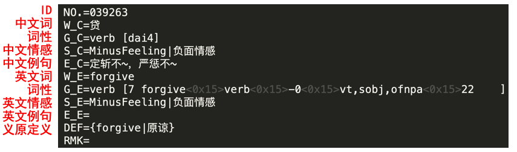

# OpenHowNet API

[中文版本](https://github.com/thunlp/OpenHowNet-API/blob/master/README_CN.md)



This project contains core data of HowNet and OpenHowNet API developed by THUNLP, for providing a convenient way to search information in HowNet, display sememe trees, calculate word similarity via sememes, etc. If you would like to learn more about OpenHowNet, please visit our [website](https://openhownet.thunlp.org).

If you are using any data or API provided by OpenHowNet, please cite the following papers:

	@article{qi2019openhownet,
	  title={OpenHowNet: An Open Sememe-based Lexical Knowledge Base},
	  author={Qi, Fanchao and Yang, Chenghao and Liu, Zhiyuan and Dong, Qiang and Sun, Maosong and Dong, Zhendong},
	  journal={arXiv preprint arXiv:1901.09957},
	  year={2019},
	}

	@inproceedings{dong2003hownet,
	  title={HowNet-a hybrid language and knowledge resource},
	  author={Dong, Zhendong and Dong, Qiang},
	  booktitle={Proceedings of NLP-KE},
	  year={2003},
	}

## Requirements

* Python==3.6
* anytree==2.4.3
* tqdm==4.31.1
* requests==2.22.0

## Installation

### Install via Pypi (recommended)
First, run `pip install OpenHowNet`

```python
import OpenHowNet
hownet_dict = OpenHowNet.HowNetDict()
```

An error will occur if you haven't downloaded the HowNet data, you need to run `OpenHowNet.download()` to make the package functional.

### Install via Github

```bash
git clone https://github.com/thunlp/OpenHowNet-API/
cd OpenHowNet-API/OpenHowNet
chmod +x run.sh
./run.sh
```

## Interfaces

|interfaces|description|params|
|---|-------|-------|
get(self, word, language=None)|Search all information annotated with a word. | "word" is the target word. "lang" is 'en'(English) or 'zh'(Chinese), searching in both languages by default.
get\_sememes\_by\_word(self, word, structured=False, lang='zh', merge=False, expanded_layer=-1) | Search sememes of the target word. You can choose whether multiple senses in the result will be merged, whether the result itself will be structured, and the expand layers of the tree | "word" is the target word. "lang" is 'en'(English) or 'zh'(Chinese). "structured" is whether the result is structured. "merge" is whether the result is merged. "expanded_layer" is number of expand layers, -1 means expand all layers.
initialize\_sememe\_similarity\_calculation(self)| Initialize the implementation of advanced feature #1 to calculate sememe similarity. May take some time to read necessary files.|
calculate\_word\_similarity(self, word0, word1)|Calculate similarity of two words. You need to run initialize\_sememe\_similarity\_calculation before calling this function.|"word0" and "word1" represents the words you are to query.
get\_nearest\_words\_via\_sememes(self, word, K=10)|Get the nearest K words to the target word with similarity calculated via sememes.|"word" is the target word, "K" is "top K" in k nearest neighbors.
get\_sememe\_relation(self, x, y)|Get relationship between sememe x and sememe y.|"x" and "y" represents the sememes you are to query.
get\_sememe\_via\_relation(self, x, relation, lang='zh')|Get all sememes that have specified relation with sememe x.|"x" is the target sememe, "relation" is the target relation, "lang" is 'en'(English) or 'zh'(Chinese)

## Usage

### Get word annotations in HowNet

By default, the api will search the target word in both English and Chinese annotations in HowNet, which will cause significant search overhead. Note that if the target word does not exist in HowNet annotation, this api will simply return an empty list.

```python
>>> result_list = hownet_dict.get("苹果")
>>> print("检索数量：",len(result_list))
>>> print("检索结果范例:",result_list[0])
检索数量： 6
检索结果范例: {'Def': '{computer|电脑:modifier={PatternValue|样式值:CoEvent={able|能:scope={bring|携带:patient={$}}}}{SpeBrand|特定牌子}}', 'en_grammar': 'noun', 'ch_grammar': 'noun', 'No': '127151', 'syn': [{'id': '004024', 'text': 'IBM'}, {'id': '041684', 'text': '戴尔'}, {'id': '049006', 'text': '东芝'}, {'id': '106795', 'text': '联想'}, {'id': '156029', 'text': '索尼'}, {'id': '004203', 'text': 'iPad'}, {'id': '019457', 'text': '笔记本'}, {'id': '019458', 'text': '笔记本电脑'}, {'id': '019459', 'text': '笔记本电脑'}, {'id': '019460', 'text': '笔记本电脑'}, {'id': '019461', 'text': '笔记本电脑'}, {'id': '019463', 'text': '笔记簿电脑'}, {'id': '019464', 'text': '笔记簿电脑'}, {'id': '020567', 'text': '便携式电脑'}, {'id': '020568', 'text': '便携式计算机'}, {'id': '020569', 'text': '便携式计算机'}, {'id': '127224', 'text': '平板电脑'}, {'id': '127225', 'text': '平板电脑'}, {'id': '172264', 'text': '膝上型电脑'}, {'id': '172265', 'text': '膝上型电脑'}], 'ch_word': '苹果', 'en_word': 'apple'}

>>> hownet_dict.get("test_for_non_exist_word")
[]
```

You can visualize the retrieved HowNet structured annotations ("sememe tree") of the target word as follow :
(K=2 means only displaying 2 sememe trees)

```python
>>> hownet_dict.visualize_sememe_trees("苹果", K=2)
Find 6 result(s)
Display #0 sememe tree
[sense]苹果
└── [None]computer|电脑
    ├── [modifier]PatternValue|样式值
    │   └── [CoEvent]able|能
    │       └── [scope]bring|携带
    │           └── [patient]$
    └── [patient]SpeBrand|特定牌子
Display #1 sememe tree
[sense]苹果
└── [None]fruit|水果
```

To boost the efficiency of the search process, you can specify the language of the target word as the following.

```python
>>> result_list = hownet_dict.get("苹果", language="zh")
>>> print("单语检索数量：",len(result_list))
>>> print("单语检索结果范例:",result_list[0])
>>> print("-------双语混合检索测试---------")
>>> print("混合检索结果数量:",len(hownet_dict.get("X")))
>>> print("中文检索结果数量:",len(hownet_dict.get("X",language="zh")))
>>> print("英语检索结果数量:",len(hownet_dict.get("X",language="en")))
单语检索数量： 6
单语检索结果范例: {'Def': '{computer|电脑:modifier={PatternValue|样式值:CoEvent={able|能:scope={bring|携带:patient={$}}}}{SpeBrand|特定牌子}}', 'en_grammar': 'noun', 'ch_grammar': 'noun', 'No': '127151', 'syn': [{'id': '004024', 'text': 'IBM'}, {'id': '041684', 'text': '戴尔'}, {'id': '049006', 'text': '东芝'}, {'id': '106795', 'text': '联想'}, {'id': '156029', 'text': '索尼'}, {'id': '004203', 'text': 'iPad'}, {'id': '019457', 'text': '笔记本'}, {'id': '019458', 'text': '笔记本电脑'}, {'id': '019459', 'text': '笔记本电脑'}, {'id': '019460', 'text': '笔记本电脑'}, {'id': '019461', 'text': '笔记本电脑'}, {'id': '019463', 'text': '笔记簿电脑'}, {'id': '019464', 'text': '笔记簿电脑'}, {'id': '020567', 'text': '便携式电脑'}, {'id': '020568', 'text': '便携式计算机'}, {'id': '020569', 'text': '便携式计算机'}, {'id': '127224', 'text': '平板电脑'}, {'id': '127225', 'text': '平板电脑'}, {'id': '172264', 'text': '膝上型电脑'}, {'id': '172265', 'text': '膝上型电脑'}], 'ch_word': '苹果', 'en_word': 'apple'}
-------双语混合检索测试---------
混合检索结果数量: 5
中文检索结果数量: 3
英语检索结果数量: 2

>>> hownet_dict.get("苹果", language="en")
[]
```

### Get All Words annotated in HowNet¶

```python
>>> ch_word_list = hownet_dict.get_ch_words()
>>> en_word_list = hownet_dict.get_en_words()
>>> print(ch_word_list[:30])
>>> print(en_word_list[:30])
['', '"', '#', '#号标签', '$', '%', "'", '(', ')', '*', '+', '-', '--', '...', '...出什么问题', '...底', '...底下', '...发生故障', '...发生了什么', '...何如', '...家里有几口人', '...检测呈阳性', '...检测呈阴性', '...来', '...内', '...为止', '...也同样使然', '...以来', '...以内', '...以上']
['A', 'An', 'Frenchmen', 'Frenchwomen', 'Ottomans', 'a', 'aardwolves', 'abaci', 'abandoned', 'abbreviated', 'abode', 'aboideaux', 'aboiteaux', 'abscissae', 'absorbed', 'acanthi', 'acari', 'accepted', 'acciaccature', 'acclaimed', 'accommodating', 'accompanied', 'accounting', 'accused', 'acetabula', 'acetified', 'aching', 'acicula', 'acini', 'acquired']
```

### Get Flattened Sememe Trees for certain word or all words in HowNet

Cautions: the parameters "lang", "merge" and "expanded_layer" only works when "structured = False". The main consideration is that there are multiple ways to interpret these params when deal with structured data. We leave the freedom to our end user. In next section, you will be able to see how to utilize the structured data.

Detailed explanation of params will be displayed in our documentation.

#### Get the full merged sememe list from multi-sense words

```python
>>> hownet_dict.get_sememes_by_word("苹果",structured=False,lang="zh",merge=True)
{'电脑', '交流', '用具', '水果', '特定牌子', '样式值', '能', '树', '生殖', '携带'}

>>> hownet_dict.get_sememes_by_word("apple",structured=False,lang="en",merge=True)
{'communicate', 'able', 'reproduce', 'SpeBrand', 'computer', 'bring', 'tool', 'PatternValue', 'tree', '$', 'fruit'}
```

Even if the language is not corresponding to the target word, the api still works. It will keep all the returned word entries to be in the same language you specified.

```python
>>> hownet_dict.get_sememes_by_word("苹果",structured=False,lang="en",merge=True)
{'apple': {'communicate', 'able', 'reproduce', 'SpeBrand', 'computer', 'bring', 'tool', 'PatternValue', 'tree', '$', 'fruit'}, 'malus pumila': {'reproduce', 'fruit', 'tree'}, 'orchard apple tree': {'reproduce', 'fruit', 'tree'}}
```

Note that, in the latest version, if the number of the word entries equals to one, for convenience, the api will simply return the set of sememes.

You could specify the number of the expanded layers like the following:

```python
>>> hownet_dict.get_sememes_by_word("苹果",structured=False,merge=True,expanded_layer=2)
{'电脑', '树', '用具', '水果'}
```

You could get all flattened sememe trees for all words as well as specify the number of the expanded layers:

```python
>>> hownet_dict.get_sememes_by_word("*",structured=False,merge=True)
# the result is too large, just try it yourself.
```

If you would like to see the sememe lists for different senses of particular word in HowNet, just need to set the param "merged" to False.

```python
>>> hownet_dict.get_sememes_by_word("苹果",structured=False,lang="zh",merge=False)
[{'word': '苹果', 'sememes': {'特定牌子', '样式值', '电脑', '能', '携带'}},
{'word': '苹果', 'sememes': {'水果'}},
{'word': '苹果', 'sememes': {'特定牌子', '样式值', '能', '交流', '用具', '携带'}},
{'word': '苹果', 'sememes': {'树', '生殖', '水果'}},
{'word': '苹果', 'sememes': {'树', '生殖', '水果'}},
{'word': '苹果', 'sememes': {'树', '生殖', '水果'}}]

>>> hownet_dict.get_sememes_by_word("apple",structured=False,lang="en",merge=False)
[{'word': 'apple', 'sememes': {'able', 'computer', 'bring', 'SpeBrand', 'PatternValue', '$'}},
{'word': 'apple', 'sememes': {'fruit'}},
{'word': 'apple', 'sememes': {'communicate', 'able', 'bring', 'tool', 'SpeBrand', 'PatternValue', '$'}},
{'word': 'apple', 'sememes': {'reproduce', 'fruit', 'tree'}},
{'word': 'apple', 'sememes': {'communicate', 'able', 'bring', 'tool', 'SpeBrand', 'PatternValue', '$'}},
{'word': 'apple', 'sememes': {'reproduce', 'fruit', 'tree'}},
{'word': 'apple', 'sememes': {'fruit'}},
{'word': 'apple', 'sememes': {'fruit'}}]
```

### Get Structured Sememe Trees for certain words in HowNet

```python
>>> hownet_dict.get_sememes_by_word("苹果",structured=True)[0]["tree"]
{'role': 'sense', 'name': '苹果','children': [
    {'role': 'None', 'name': 'computer|电脑', 'children': [
        {'role': 'modifier', 'name': 'PatternValue|样式值', 'children': [
            {'role': 'CoEvent', 'name': 'able|能', 'children': [
                {'role': 'scope', 'name': 'bring|携带', 'children': [
                    {'role': 'patient', 'name': '$'}
                ]}
            ]}
        ]},
        {'role': 'patient', 'name': 'SpeBrand|特定牌子'}
    ]}
]}
```

Two ways to see the corresponding annotation data

```python
>>> hownet_dict.get_sememes_by_word("苹果",structured=True)[0]["tree"] # or
>>> hownet_dict.get_sememes_by_word("苹果",structured=True)[0]["word"]
>>> # two results are the same, only displaying one
{'Def': '{computer|电脑:modifier={PatternValue|样式值:CoEvent={able|能:scope={bring|携带:patient={$}}}}{SpeBrand|特定牌子}}',
'en_grammar': 'noun',
'ch_grammar': 'noun',
'No': '127151',
'syn': [
    {'id': '004024', 'text': 'IBM'},
    {'id': '041684', 'text': '戴尔'},
    {'id': '049006', 'text': '东芝'},
    {'id': '106795', 'text': '联想'},
    {'id': '156029', 'text': '索尼'},
    {'id': '004203', 'text': 'iPad'},
    {'id': '019457', 'text': '笔记本'},
    {'id': '019458', 'text': '笔记本电脑'},
    {'id': '019459', 'text': '笔记本电脑'},
    {'id': '019460', 'text': '笔记本电脑'},
    {'id': '019461', 'text': '笔记本电脑'},
    {'id': '019463', 'text': '笔记簿电脑'},
    {'id': '019464', 'text': '笔记簿电脑'},
    {'id': '020567', 'text': '便携式电脑'},
    {'id': '020568', 'text': '便携式计算机'},
    {'id': '020569', 'text': '便携式计算机'},
    {'id': '127224', 'text': '平板电脑'},
    {'id': '127225', 'text': '平板电脑'},
    {'id': '172264', 'text': '膝上型电脑'},
    {'id': '172265', 'text': '膝上型电脑'}
],
'ch_word': '苹果',
'en_word': 'apple'}
```

### Get the static synonyms of the certain word

The similarity metrics are based on HowNet.

```python
>>> hownet_dict["苹果"][0]["syn"]
[{'id': '004024', 'text': 'IBM'},
 {'id': '041684', 'text': '戴尔'},
 {'id': '049006', 'text': '东芝'},
 {'id': '106795', 'text': '联想'},
 {'id': '156029', 'text': '索尼'},
 {'id': '004203', 'text': 'iPad'},
 {'id': '019457', 'text': '笔记本'},
 {'id': '019458', 'text': '笔记本电脑'},
 {'id': '019459', 'text': '笔记本电脑'},
 {'id': '019460', 'text': '笔记本电脑'},
 {'id': '019461', 'text': '笔记本电脑'},
 {'id': '019463', 'text': '笔记簿电脑'},
 {'id': '019464', 'text': '笔记簿电脑'},
 {'id': '020567', 'text': '便携式电脑'},
 {'id': '020568', 'text': '便携式计算机'},
 {'id': '020569', 'text': '便携式计算机'},
 {'id': '127224', 'text': '平板电脑'},
 {'id': '127225', 'text': '平板电脑'},
 {'id': '172264', 'text': '膝上型电脑'},
 {'id': '172265', 'text': '膝上型电脑'}]
```

### Get access of the word by ID

```python
>>> hownet_dict["004024"]
['Def', 'en_grammar', 'ch_grammar', 'No', 'syn', 'ch_word', 'en_word']
```

### Get all sememes

```python
>>> len(hownet_dict.get_all_sememes())
2187
```

### Get relationship between two sememes

The sememes you input can be in any language.

```python
>>> hownet_dict.get_sememe_relation("音量值", "尖声")
>>> hownet_dict.get_sememe_relation("音量值", "shrill")
>>> hownet_dict.get_sememe_relation("尖声", "SoundVolumeValue")
>>> hownet_dict.get_sememe_relation("shrill", "SoundVolumeValue")
'hyponym'
'hyponym'
'hypernym'
'hypernym'
```

The output could be hypernym, hyponym, antonym or converse.

### Get a sememe by another and the relation between them

The sememe you input can be in any language, but the relation must be in lowercase. You can specify the language of result, by default it will be Chinese.

```python
>>> hownet_dict.get_sememe_via_relation("音量值", "hyponym")
>>> hownet_dict.get_sememe_via_relation("音量值", "hyponym", lang="en")
>>> hownet_dict.get_sememe_via_relation("SoundVolumeValue", "hyponym", lang="en")
['高声', '低声', '尖声', '沙哑', '无声', '有声']
['loud', 'LowVoice', 'shrill', 'hoarse', 'silent', 'talking']
['loud', 'LowVoice', 'shrill', 'hoarse', 'silent', 'talking']
```

## Advanced Feature #1: Word Similarity Calculation via Sememes

The following parts are mainly implemented by Jun Yan and integrated by Chenghao Yang. Our implementation is based on the paper:

> Jiangming Liu, Jinan Xu, Yujie Zhang. An Approach of Hybrid Hierarchical Structure for Word Similarity Computing by HowNet. In Proceedings of IJCNLP

### Extra Initialization

Because there are some files required to be loaded for similarity calculation, the initialization overhead will be larger than before. To begin with, you can initialize the hownet_dict object as the following code:

```python
>>> hownet_dict_advanced = OpenHowNet.HowNetDict(use_sim=True)
```

You can also postpone the initialization work of similarity calculation until use. The following code serves as an example and the return value will indicate whether the extra initialization process succeed.

```python
>>> hownet_dict.initialize_sememe_similarity_calculation()
True
```

### Get Top-K Nearest Words for the Given Word

If the given word does not exist in HowNet annotations, this function will return an empty list.

```python
>>> query_result = hownet_dict_advanced.get_nearest_words_via_sememes("苹果",20)
>>> example = query_result[0]
>>> print("word_name:",example["word"])
>>> print("id:",example["id"])
>>> print("synset and corresonding word&id&score:")
>>> print(example["synset"])
word_name: 苹果
id: 127151
synset and corresonding word&id&score:
[{'id': 4024, 'word': 'IBM', 'score': 1.0},
 {'id': 41684, 'word': '戴尔', 'score': 1.0},
 {'id': 49006, 'word': '东芝', 'score': 1.0},
 {'id': 106795, 'word': '联想', 'score': 1.0},
 {'id': 156029, 'word': '索尼', 'score': 1.0},
 {'id': 4203, 'word': 'iPad', 'score': 0.865},
 {'id': 19457, 'word': '笔记本', 'score': 0.865},
 {'id': 19458, 'word': '笔记本电脑', 'score': 0.865},
 {'id': 19459, 'word': '笔记本电脑', 'score': 0.865},
 {'id': 19460, 'word': '笔记本电脑', 'score': 0.865},
 {'id': 19461, 'word': '笔记本电脑', 'score': 0.865},
 {'id': 19463, 'word': '笔记簿电脑', 'score': 0.865},
 {'id': 19464, 'word': '笔记簿电脑', 'score': 0.865},
 {'id': 20567, 'word': '便携式电脑', 'score': 0.865},
 {'id': 20568, 'word': '便携式计算机', 'score': 0.865},
 {'id': 20569, 'word': '便携式计算机', 'score': 0.865},
 {'id': 127224, 'word': '平板电脑', 'score': 0.865},
 {'id': 127225, 'word': '平板电脑', 'score': 0.865},
 {'id': 172264, 'word': '膝上型电脑', 'score': 0.865},
 {'id': 172265, 'word': '膝上型电脑', 'score': 0.865}]
```

### Calculate the Similarity for the Given Two Words

If any of the given words does not exist in HowNet annotations, this function will return 0.

```python
>>> hownet_dict_advanced.calculate_word_similarity("苹果", "梨")
1.0
```

## License

MIT